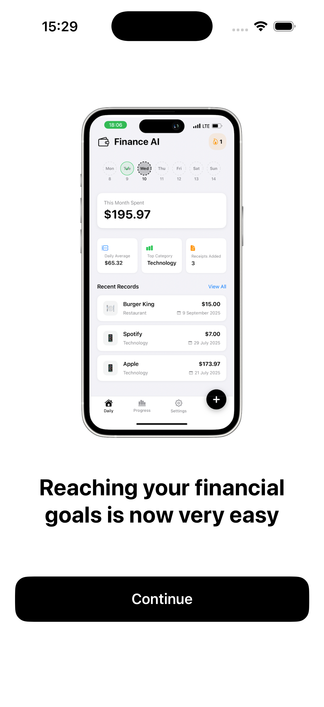
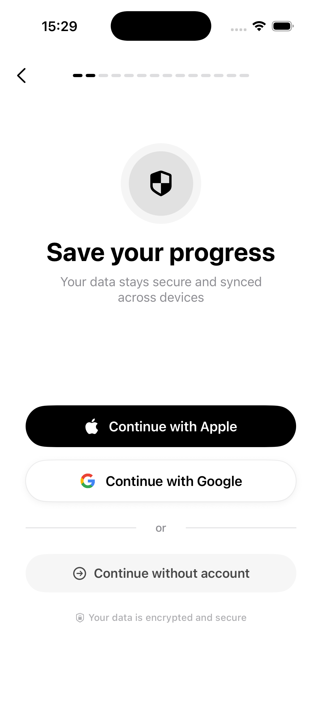
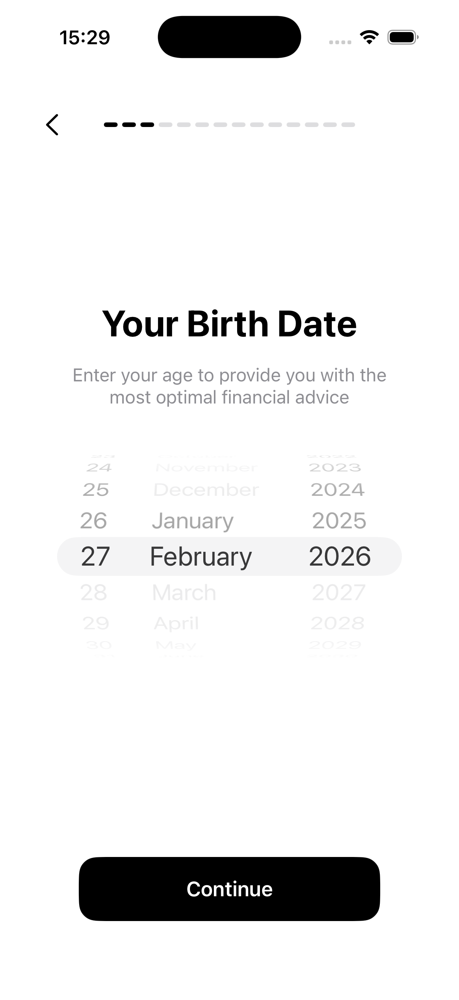
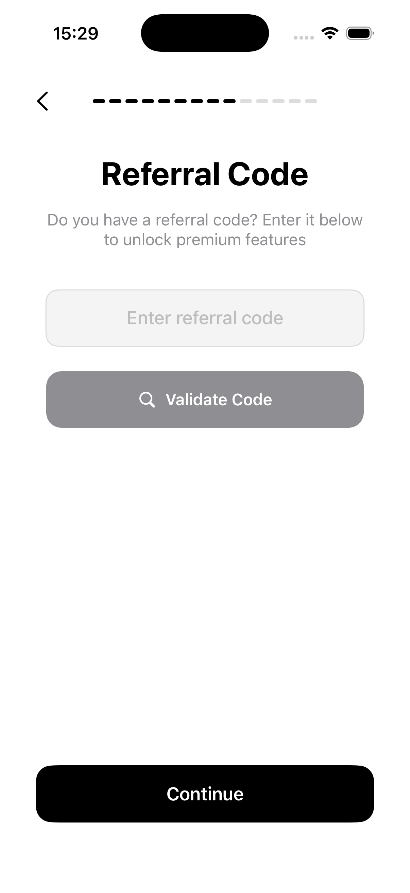
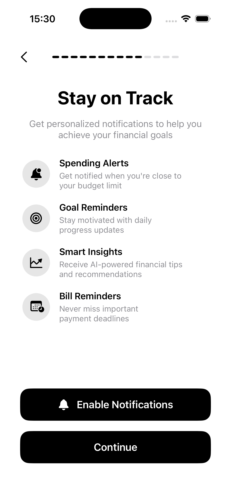
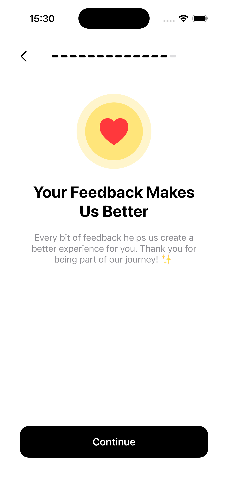
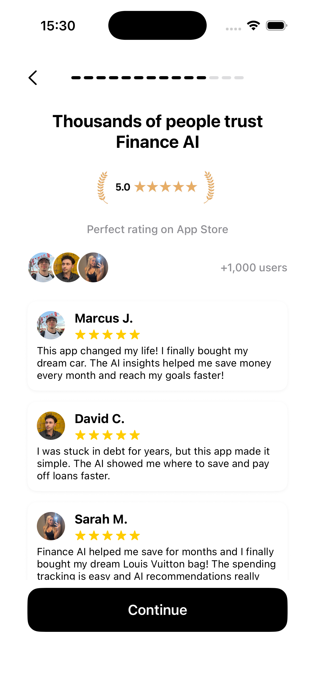
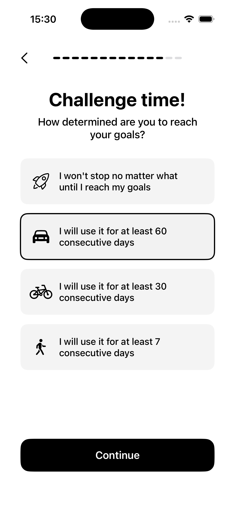
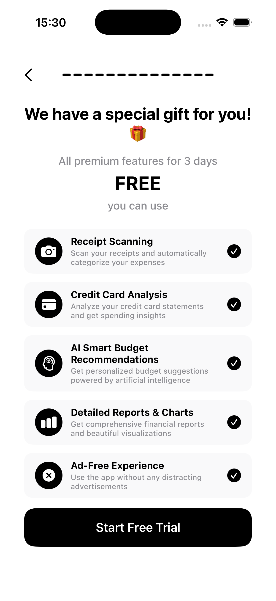

# 🚀 Premium iOS Onboarding Framework

[](https://swift.org)
[](https://apple.com)
[](https://apple.com)
[](https://developer.apple.com/xcode/swiftui/)
[](LICENSE)

**Premium-iOS-Onboarding** is a state-of-the-art, production-ready onboarding sequence designed to maximize user retention and provide a high-end first impression. Built entirely with SwiftUI, this framework follows Apple's Human Interface Guidelines (HIG) while pushing the boundaries of modern mobile design.

---

## ✨ Visual Experience

<div align="center">
  <table>
    <tr>
      <td width="33%"></td>
      <td width="33%"></td>
      <td width="33%"></td>
    </tr>
    <tr>
      <td width="33%"></td>
      <td width="33%"></td>
      <td width="33%"></td>
    </tr>
    <tr>
      <td width="33%"></td>
      <td width="33%"></td>
      <td width="33%"></td>
    </tr>
  </table>
</div>

---

## 🛠 Features

- **🎯 Data-Driven Onboarding**: Seamlessly collect user insights (Income, Goals, Risk Profile) to personalize the app experience.
- **✨ Fluid Animations**: Physics-based transitions and haptic-feedback integration for a premium feel.
- **🔐 Secure Authentication**: Ready-to-use Apple, Google, and Anonymous sign-in interfaces.
- **📊 Real-time Visualizations**: Interactive financial charts showing projected success paths.
- **🎁 Premium Upsell**: Built-in high-converting Paywall/Premium features showcase.
- **🏗 Robust Architecture**: Implementation follows strict **MVVM + Clean Architecture** patterns for maximum scalability.

---

## 🌎 Open Source Community Support

This project is backed by a growing collective of iOS developers and UI/UX designers dedicated to building the future of mobile experiences. 

- **Enterprise Reliability**: Used by high-traffic applications to ensure a smooth user entry.
- **Active Collaboration**: Our community regularly contributes new components, animation styles, and accessibility improvements.
- **Scalable Infrastructure**: Designed to be extended easily—whether you're a solo indie hacker or an enterprise team.

*We believe that the first 30 seconds of an app determine its success. This project is our gift to the community to help every developer create world-class apps.*

---

## 🚀 Getting Started

### Requirements
- iOS 15.0+
- Xcode 15.0+
- Swift 5.10+

### Installation
Simply clone the repository and integrate the `Onboarding` folder into your project:

```bash
git clone https://github.com/tunaarikaya/Tuna-Onboarding.git
```

*Note: For production use, remember to reconnect your preferred backend (Firebase, Supabase, etc.) using the provided `Compatibility.swift` patterns.*

---

## 🤝 Contributing

We love contributions! Whether it's a bug fix, a new design pattern, or just a suggestion, feel free to open a Pull Request or Issue. Let's build the best onboarding experience together!

---

## 📬 Contact & Support

**Mehmet Tuna Arıkaya**  
Lead iOS Architect & Creative Developer

[](https://linkedin.com/in/tunaarikaya)
[](https://github.com/tunaarikaya)

---

<p align="center">
  Made with ❤️ by Tuna Arıkaya
</p>
